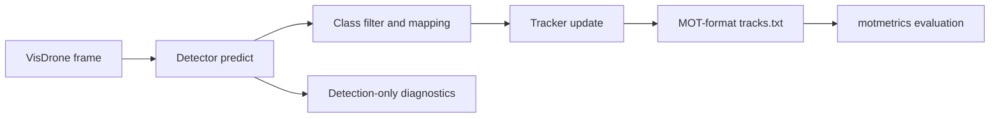

# VisDrone Multi-Object Tracking Benchmark

Computer vision evaluation project for comparing detector and tracker choices
on the `VisDrone2019-MOT-val` split. The project does not claim to implement
YOLO, RT-DETR, ByteTrack, BoT-SORT, or SAHI from scratch. It focuses on a
modular MOT pipeline, experiment design, detector/tracker adapters,
diagnostics, and failure analysis around those components.

## Overview

This repository benchmarks multi-object tracking pipelines for drone video,
where small objects, occlusion, camera motion, and dense road scenes make
tracking brittle. The pipeline keeps detection and tracking decoupled:



Only VisDrone classes `1` pedestrian and `4` car are evaluated. The VisDrone
`det/` folder is intentionally ignored; all predictions are produced by the
configured detector wrappers.

## What Was Evaluated

| Family | Detector | Tracker | Purpose |
|---|---|---|---|
| M1 | YOLOv11 | SORT | Geometric baseline |
| M2 | YOLO26 | ByteTrack / BoT-SORT | Fast confidence-aware baseline |
| M3 | RT-DETR | BoT-SORT | Accuracy-oriented detector, appearance cues, GMC |
| M4 | YOLO26 + SAHI / upscaling | BoT-SORT | Small-object recall experiments |

Key experimental axes:

- detector confidence tuning for RT-DETR;
- detection-only precision, recall, and AP50 before tracking;
- per-sequence MOT diagnostics;
- BoT-SORT global motion compensation (GMC) on/off;
- small-object strategies using upscaling and stricter SAHI slicing.

## Main Result

Canonical full-validation summaries are in
[`results/2-tuning/`](results/2-tuning/). The selected final method is
`rtdetr_botsort_conf055_gmc_on`: it has the best full-validation MOTA while
keeping identity switches low.

| Method | MOTA | IDF1 | FP | FN | IDS | FPS | Note |
|---|---:|---:|---:|---:|---:|---:|---|
| `rtdetr_botsort_conf055_gmc_on` | **0.214** | 0.436 | 8.8k | 41.5k | **102** | 4.2 | selected final method |
| `m3_rtdetr_botsort_conf050` | 0.211 | **0.465** | 11.6k | **38.9k** | 133 | 4.0 | recall/IDF1-oriented |
| `yolo26_botsort_gmc_on` | 0.180 | 0.370 | 6.4k | 46.1k | 176 | 39.0 | faster BoT-SORT baseline |
| `m2_yolo26_bytetrack_conf035` | 0.169 | 0.325 | **6.0k** | 47.0k | 332 | **48.9** | fastest tracked baseline |
| `sahi_yolo26_botsort_slice768_overlap015_conf040` | 0.092 | 0.423 | 22.5k | 35.5k | 281 | 3.8 | recall gain, FP-heavy |
| `yolo26_upscale20_botsort` | 0.110 | 0.463 | 23.8k | 33.1k | 295 | 14.0 | recall gain, FP-heavy |

Interpretation:

- RT-DETR + BoT-SORT + GMC is the best balanced method in this run.
- GMC reduces identity switches strongly: RT-DETR IDS drops from 294 to 102.
- On `uav0000305_00000_v`, the crossroad failure is detector-limited:
  YOLO26 car recall is about 0.160, RT-DETR car recall is about 0.314, and
  pedestrian recall is 0 for both.
- SAHI and upscaling recover more small objects but introduce many false
  positives and false tracks, so recall alone does not guarantee better MOT.

See [`docs/EXPERIMENTS.md`](docs/EXPERIMENTS.md) for protocol details and
[`docs/FAILURE_ANALYSIS.md`](docs/FAILURE_ANALYSIS.md) for sequence-level
diagnosis.

## Representative Visual Outputs

Still-frame presentation assets and the compiled Beamer deck are included:

- [`slides/main.pdf`](slides/main.pdf): final technical presentation.
- [`slides/visual_revision_notes.md`](slides/visual_revision_notes.md):
  provenance for selected frames, slide-level asset usage, and a
  fast-presentation subset.
- [`slides/img/visuals/`](slides/img/visuals/): selected still-frame evidence
  used in the deck.

The visuals emphasize:

- crossroad missed detections on `uav0000305_00000_v`;
- RT-DETR vs YOLO26 detector coverage;
- GMC off/on identity stability;
- SAHI/upscaling recall and FP tradeoffs.

## Installation

Python 3.12 or 3.13 is recommended for the optional BoxMOT trackers.

```bash
python3.13 -m venv .venv
source .venv/bin/activate
python -m pip install --upgrade pip setuptools wheel
python -m pip install -r requirements.txt
python -m pip install -r requirements-trackers.txt
python -m pip install -r requirements-sahi.txt
```

Core YOLO + SORT runs only need `requirements.txt`. ByteTrack and BoT-SORT use
BoxMOT from `requirements-trackers.txt`; SAHI experiments use
`requirements-sahi.txt`. See
[`docs/environment_setup.md`](docs/environment_setup.md) for troubleshooting.

## Dataset Layout

Pass `--dataset-root` as a folder with this layout:

```text
VisDrone2019-MOT-val/
  sequences/<sequence_name>/0000001.jpg
  annotations/<sequence_name>.txt
  det/                         # ignored by this project
```

Model weights such as `yolo11n.pt`, `yolo26n.pt`, and `rtdetr-l.pt` may be
downloaded by Ultralytics on first use, or placed locally and referenced from
YAML configs.

## Reproduce the Main Experiment Suite

```bash
python run_next_experiments.py \
  --dataset VisDrone2019-MOT-val \
  --device mps
```

The suite is resumable under `outputs/next_experiments/default/`. Re-running
the command skips completed attempts unless `--force` is passed. Use `--device
cuda` or `--device cpu` as appropriate.

Key outputs:

```text
outputs/next_experiments/default/summaries/
  detection_summary_by_method.csv
  detection_summary_by_sequence.csv
  detection_summary_by_class.csv
  final_summary_by_method.csv
  final_summary_by_sequence.csv
  mot_diagnostics_by_sequence.csv
  gmc_ablation_summary.csv
  next_experiments_report.md
```

## Quick Smoke Test

```bash
python -m src.experiments.run_sequence \
  --config configs/m1_yolo11_sort_smoke.yaml \
  --dataset-root VisDrone2019-MOT-val \
  --sequence-name uav0000137_00458_v \
  --max-frames 100 \
  --save-video
```

List sequences:

```bash
python -m src.experiments.run_sequence \
  --dataset-root VisDrone2019-MOT-val \
  --list-sequences
```

## Evaluation Commands

Run a representative benchmark:

```bash
python -m src.experiments.run_benchmark \
  --dataset-root VisDrone2019-MOT-val \
  --configs \
    configs/m1_yolo11_sort_smoke.yaml \
    configs/m2_yolo26_bytetrack_smoke.yaml \
    configs/m3_rtdetr_botsort_smoke.yaml \
  --max-frames 300 \
  --save-video \
  --evaluate
```

Run detection-only diagnostics:

```bash
python -m src.evaluation.evaluate_detection \
  --dataset-root VisDrone2019-MOT-val \
  --configs \
    configs/overnight/m2_yolo26_bytetrack_conf035.yaml \
    configs/overnight/m3_rtdetr_botsort_conf055.yaml \
  --output-dir outputs/evaluation/detection_only \
  --device mps
```

Render videos from existing `tracks.txt` files:

```bash
python -m src.visualization.render_tracks_video \
  --dataset-root VisDrone2019-MOT-val \
  --tracks-root outputs/next_experiments/default/stages/gmc_ablation/rtdetr_botsort_conf055_gmc_on/attempts/001/benchmark/runs \
  --sequences uav0000339_00001_v \
  --overwrite
```

## Metrics

- `MOTA`: tracking accuracy; penalizes FP, FN, and ID switches.
- `MOTP`: localization distance as reported by `motmetrics`.
- `IDF1`: identity consistency score.
- `FP` / `FN`: false positives and false negatives.
- `IDS`: identity switches.
- `FPS`: measured runtime throughput when benchmark metadata is available.
- Detection-only `precision`, `recall`, and `AP50`: frame-by-frame,
  class-aware matching at IoU 0.50 before tracking.

See [`docs/METRICS.md`](docs/METRICS.md) for exact definitions and caveats.

## Repository Structure

```text
configs/                  YAML experiment configs
docs/                     protocol, metrics, reproducibility, and analysis notes
results/                  curated CSV summaries used in README/slides
run_next_experiments.py   resumable next-step experiment suite
src/
  detection/              Ultralytics, SAHI, and upscaling detector wrappers
  tracking/               SORT and BoxMOT tracker adapters
  evaluation/             MOT and detection-only evaluators
  experiments/            sequence, benchmark, and overnight runners
  visualization/          track rendering utilities
tests/                    unit and smoke tests for adapters/evaluation
slides/                   Beamer source and compiled presentation
slides/img/visuals/       selected still-frame visual evidence
```

## Limitations

- Results are benchmark/evaluation results, not detector fine-tuning results.
- Model performance depends on local hardware, installed tracker dependencies,
  and available Ultralytics weights.
- SAHI/upscaling experiments show recall potential but need stronger FP control
  before becoming a final method.
- The highlighted validation split is small enough for focused analysis, not a
  broad production benchmark.
